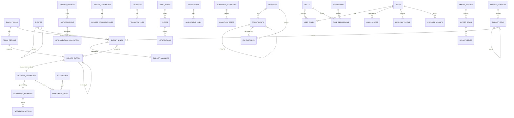

# E و F — مخطط قاعدة البيانات (ERD) والجداول

**PostgreSQL 16.** كل المفاتيح الأساسية `UUID` (`gen_random_uuid()`)، ما عدا تسلسلات الترقيم (`entry_no` و`audit_log.id`) لأنها `BIGINT` لضمان الترتيب. المبالغ `NUMERIC(18,3)`. الأوقات `TIMESTAMPTZ`.

## 1. مخطط العلاقات (ERD)



`FINANCIAL_DOCUMENTS` مفهوم منطقي يمثل (authorizations، transfers، commitments، expenditures، adjustments، budget_documents). الربط متعدد الأشكال يتم عبر الزوج (`source_type`, `source_id`) مع جدول `document_registry` الذي يضمن التكامل (§3.4).

## 2. الأنواع (Enums)

```sql
CREATE TYPE fiscal_year_status   AS ENUM ('PLANNING','OPEN','CLOSING','CLOSED');
CREATE TYPE period_status        AS ENUM ('OPEN','CLOSED');
CREATE TYPE control_basis        AS ENUM ('APPROPRIATION','AUTHORIZATION','TWO_LEVEL');
CREATE TYPE balance_component    AS ENUM ('APPROPRIATION','ALLOCATION','TRANSFER_IN','TRANSFER_OUT',
                                          'RESERVATION','COMMITMENT','ACTUAL');
CREATE TYPE txn_type             AS ENUM ('ORIGINAL_BUDGET','BUDGET_ALLOCATION','BUDGET_INCREASE',
    'BUDGET_DECREASE','TRANSFER_IN','TRANSFER_OUT','PRE_COMMITMENT','RESERVATION_RELEASE',
    'COMMITMENT','COMMITMENT_LIQUIDATION','ACTUAL_EXPENDITURE','ADJUSTMENT','REVERSAL',
    'CANCELLATION','CLOSING','CARRY_FORWARD');
CREATE TYPE doc_status           AS ENUM ('DRAFT','SUBMITTED','IN_REVIEW','APPROVED','POSTED',
                                          'REJECTED','RETURNED','CANCELLED','REVERSED');
CREATE TYPE commitment_type      AS ENUM ('PURCHASE_REQUEST','PURCHASE_ORDER','CONTRACT','OBLIGATION','OTHER');
CREATE TYPE commitment_status    AS ENUM ('DRAFT','PENDING_APPROVAL','APPROVED','PARTIALLY_PAID',
                                          'FULLY_PAID','CANCELLED','CLOSED');
CREATE TYPE authorization_type   AS ENUM ('FINANCIAL','DEPARTMENTAL','OTHER');   -- مالي / مصلحي
CREATE TYPE payment_method       AS ENUM ('CHEQUE','BANK_TRANSFER','CASH','DEPOSIT_ACCOUNT','OTHER');
CREATE TYPE alert_severity       AS ENUM ('INFO','WARNING','HIGH','CRITICAL');
CREATE TYPE alert_status         AS ENUM ('OPEN','ACKNOWLEDGED','RESOLVED','DISMISSED');
```

## 3. الجداول

### 3.1 البيانات المرجعية

```sql
CREATE TABLE fiscal_years (
  id             UUID PRIMARY KEY DEFAULT gen_random_uuid(),
  year           SMALLINT NOT NULL UNIQUE CHECK (year BETWEEN 2000 AND 2100),
  start_date     DATE NOT NULL,
  end_date       DATE NOT NULL,
  status         fiscal_year_status NOT NULL DEFAULT 'PLANNING',
  control_basis  control_basis NOT NULL DEFAULT 'TWO_LEVEL',
  count_reservations BOOLEAN NOT NULL DEFAULT TRUE,          -- D-12
  carry_forward_item_id UUID NULL REFERENCES budget_items(id), -- D-08
  created_at TIMESTAMPTZ NOT NULL DEFAULT now(),
  CHECK (end_date > start_date)
);

CREATE TABLE fiscal_periods (
  id UUID PRIMARY KEY DEFAULT gen_random_uuid(),
  fiscal_year_id UUID NOT NULL REFERENCES fiscal_years(id),
  period_no SMALLINT NOT NULL CHECK (period_no BETWEEN 1 AND 13),   -- 13 = فترة تسويات
  start_date DATE NOT NULL, end_date DATE NOT NULL,
  status period_status NOT NULL DEFAULT 'OPEN',
  closed_by UUID REFERENCES users(id), closed_at TIMESTAMPTZ,
  UNIQUE (fiscal_year_id, period_no)
);

CREATE TABLE entities (                       -- الجهات والقطاعات (D-09)
  id UUID PRIMARY KEY DEFAULT gen_random_uuid(),
  code VARCHAR(30) NOT NULL UNIQUE,
  name VARCHAR(200) NOT NULL,
  parent_id UUID REFERENCES entities(id),
  is_active BOOLEAN NOT NULL DEFAULT TRUE
);

CREATE TABLE budget_chapters (                -- الأبواب
  id UUID PRIMARY KEY DEFAULT gen_random_uuid(),
  code VARCHAR(10) NOT NULL UNIQUE,           -- '2'
  name VARCHAR(200) NOT NULL,                 -- 'الباب الثاني: النفقات التسييرية'
  is_active BOOLEAN NOT NULL DEFAULT TRUE,
  display_order INT NOT NULL DEFAULT 0
);

CREATE TABLE budget_items (                   -- دليل البنود
  id UUID PRIMARY KEY DEFAULT gen_random_uuid(),
  chapter_id UUID NOT NULL REFERENCES budget_chapters(id),
  code VARCHAR(20) NOT NULL,                  -- '2/18'
  name VARCHAR(200) NOT NULL,
  parent_id UUID REFERENCES budget_items(id),
  budget_type VARCHAR(30) NOT NULL DEFAULT 'EXPENSE',
  is_postable BOOLEAN NOT NULL DEFAULT TRUE,  -- الأب غير قابل للترحيل
  is_active BOOLEAN NOT NULL DEFAULT TRUE,
  display_order INT NOT NULL DEFAULT 0,
  UNIQUE (chapter_id, code),
  CHECK (code ~ '^[0-9]+(/[0-9]+)+$')
);

CREATE TABLE budget_lines (                   -- نقطة الرقابة
  id UUID PRIMARY KEY DEFAULT gen_random_uuid(),
  fiscal_year_id UUID NOT NULL REFERENCES fiscal_years(id),
  entity_id UUID NOT NULL REFERENCES entities(id),
  item_id UUID NOT NULL REFERENCES budget_items(id),
  UNIQUE (fiscal_year_id, entity_id, item_id)
);

CREATE TABLE budget_balances (                -- ذاكرة مؤقتة تُطابَق مع القيود (INV-08)
  budget_line_id UUID PRIMARY KEY REFERENCES budget_lines(id),
  appropriation NUMERIC(18,3) NOT NULL DEFAULT 0,
  allocation    NUMERIC(18,3) NOT NULL DEFAULT 0,
  transfer_in   NUMERIC(18,3) NOT NULL DEFAULT 0,
  transfer_out  NUMERIC(18,3) NOT NULL DEFAULT 0,
  reservation   NUMERIC(18,3) NOT NULL DEFAULT 0 CHECK (reservation >= 0),
  commitment    NUMERIC(18,3) NOT NULL DEFAULT 0 CHECK (commitment  >= 0),
  actual        NUMERIC(18,3) NOT NULL DEFAULT 0,
  version BIGINT NOT NULL DEFAULT 0,
  updated_at TIMESTAMPTZ NOT NULL DEFAULT now()
);

CREATE TABLE funding_sources (id UUID PRIMARY KEY DEFAULT gen_random_uuid(),
  code VARCHAR(30) UNIQUE NOT NULL, name VARCHAR(200) NOT NULL, is_active BOOLEAN NOT NULL DEFAULT TRUE);

CREATE TABLE suppliers (                      -- الموردون والمستفيدون
  id UUID PRIMARY KEY DEFAULT gen_random_uuid(),
  name VARCHAR(250) NOT NULL,
  name_normalized VARCHAR(250) NOT NULL,      -- للبحث وكشف التكرار
  kind VARCHAR(20) NOT NULL DEFAULT 'COMPANY',-- COMPANY / PERSON / GOV_ACCOUNT
  tax_no VARCHAR(50), commercial_reg VARCHAR(50), phone VARCHAR(30), notes TEXT,
  is_active BOOLEAN NOT NULL DEFAULT TRUE
);
CREATE INDEX ix_suppliers_name_trgm ON suppliers USING gin (name_normalized gin_trgm_ops);
```

### 3.2 المستندات المالية

أعمدة مشتركة في كل جدول مستند (تُكتب هنا مرة واحدة، والجداول أدناه ترثها): `id UUID PK`، `fiscal_year_id FK`، `status doc_status`، `created_by FK users`، `created_at`، `updated_by`، `updated_at`، `submitted_at`، `posted_by`، `posted_at`، `row_version INT` (قفل تفاؤلي)، `legacy_ref VARCHAR(100)` (مرجع Excel)، `import_batch_id FK NULL`، `is_historical_exception BOOL` (D-02).

```sql
CREATE TABLE budget_documents (               -- اعتماد أصلي / تعزيز / تخفيض
  ...common...,
  doc_no VARCHAR(50) NOT NULL, doc_date DATE NOT NULL,
  kind txn_type NOT NULL CHECK (kind IN ('ORIGINAL_BUDGET','BUDGET_INCREASE','BUDGET_DECREASE')),
  reference VARCHAR(100), description TEXT NOT NULL,
  UNIQUE (fiscal_year_id, kind, doc_no)
);
CREATE TABLE budget_document_lines (
  id UUID PK, document_id UUID NOT NULL REFERENCES budget_documents(id),
  budget_line_id UUID NOT NULL REFERENCES budget_lines(id),
  amount NUMERIC(18,3) NOT NULL CHECK (amount > 0),
  UNIQUE (document_id, budget_line_id)
);

CREATE TABLE authorizations (                 -- التفويضات
  ...common...,
  auth_no VARCHAR(50) NOT NULL,               -- 479
  auth_type authorization_type NOT NULL,      -- مالي / مصلحي
  auth_date DATE NOT NULL,
  entity_id UUID NOT NULL REFERENCES entities(id),
  period_from DATE, period_to DATE,
  amount NUMERIC(18,3) NOT NULL CHECK (amount > 0),
  purpose TEXT NOT NULL,
  funding_source_id UUID REFERENCES funding_sources(id),
  over_allocation_approved_by UUID REFERENCES users(id),   -- FR-AU-03
  over_allocation_reason TEXT,
  UNIQUE (fiscal_year_id, auth_type, auth_no),
  CHECK (period_to IS NULL OR period_from IS NULL OR period_to >= period_from)
);
CREATE TABLE authorization_allocations (
  id UUID PK, authorization_id UUID NOT NULL REFERENCES authorizations(id),
  budget_line_id UUID NOT NULL REFERENCES budget_lines(id),
  amount NUMERIC(18,3) NOT NULL CHECK (amount > 0),
  UNIQUE (authorization_id, budget_line_id)
);
-- Trigger: SUM(allocations.amount) <= authorizations.amount ما لم يكن over_allocation_approved_by موجودًا

CREATE TABLE transfers (                      -- المناقلات
  ...common...,
  transfer_no VARCHAR(50) NOT NULL, transfer_date DATE NOT NULL,
  reason TEXT NOT NULL, approval_no VARCHAR(50),
  approved_by UUID REFERENCES users(id),
  UNIQUE (fiscal_year_id, transfer_no)
);
CREATE TABLE transfer_lines (
  id UUID PK, transfer_id UUID NOT NULL REFERENCES transfers(id),
  from_line_id UUID NOT NULL REFERENCES budget_lines(id),
  to_line_id   UUID NOT NULL REFERENCES budget_lines(id),
  amount NUMERIC(18,3) NOT NULL CHECK (amount > 0),
  CHECK (from_line_id <> to_line_id)
);
-- Trigger: السطران في نفس السنة المالية للمناقلة

CREATE TABLE commitments (                    -- الحجوزات والارتباطات
  ...common...,
  commitment_no VARCHAR(50) NOT NULL,
  commitment_type commitment_type NOT NULL,
  commitment_status commitment_status NOT NULL DEFAULT 'DRAFT',
  commitment_date DATE NOT NULL,
  budget_line_id UUID NOT NULL REFERENCES budget_lines(id),
  supplier_id UUID REFERENCES suppliers(id),
  parent_id UUID REFERENCES commitments(id),  -- طلب شراء ← أمر شراء
  amount NUMERIC(18,3) NOT NULL CHECK (amount > 0),
  description TEXT NOT NULL,
  expected_completion DATE,
  carried_from_id UUID REFERENCES commitments(id),   -- CARRY_FORWARD
  UNIQUE (fiscal_year_id, commitment_type, commitment_no)
);
-- المسدد والقائم يُحسبان من ledger_entries (source = هذا الارتباط)، ولا يُخزنان كحقول قابلة للتحرير

CREATE TABLE expenditures (                   -- المصروف الفعلي
  ...common...,
  document_no VARCHAR(50) NOT NULL,
  document_type VARCHAR(30) NOT NULL DEFAULT 'PAYMENT_VOUCHER',
  expenditure_date DATE NOT NULL,
  date_is_estimated BOOLEAN NOT NULL DEFAULT FALSE,     -- D-04
  budget_line_id UUID NOT NULL REFERENCES budget_lines(id),
  supplier_id UUID REFERENCES suppliers(id),
  commitment_id UUID REFERENCES commitments(id),
  expense_type VARCHAR(50),
  amount NUMERIC(18,3) NOT NULL CHECK (amount > 0),
  payment_method payment_method NOT NULL,
  payment_order_no VARCHAR(50), cheque_no VARCHAR(50),
  notes TEXT,
  UNIQUE (fiscal_year_id, document_type, document_no)
);

CREATE TABLE adjustments (                    -- التسويات والقيود العكسية
  ...common...,
  adjustment_no VARCHAR(50) NOT NULL, adjustment_date DATE NOT NULL,
  kind txn_type NOT NULL CHECK (kind IN ('ADJUSTMENT','REVERSAL')),
  reverses_source_type VARCHAR(40), reverses_source_id UUID,   -- للقيد العكسي
  reason TEXT NOT NULL,
  UNIQUE (fiscal_year_id, adjustment_no)
);
CREATE TABLE adjustment_lines (
  id UUID PK, adjustment_id UUID NOT NULL REFERENCES adjustments(id),
  budget_line_id UUID NOT NULL REFERENCES budget_lines(id),
  component balance_component NOT NULL, direction SMALLINT NOT NULL CHECK (direction IN (-1,1)),
  amount NUMERIC(18,3) NOT NULL CHECK (amount > 0)
);

CREATE TABLE override_grants (                -- صلاحية تجاوز الرصيد (D-10)
  id UUID PK, user_id UUID NOT NULL REFERENCES users(id),
  budget_line_id UUID REFERENCES budget_lines(id),     -- NULL = كل البنود في نطاقه
  max_amount NUMERIC(18,3) NOT NULL CHECK (max_amount > 0),
  used_amount NUMERIC(18,3) NOT NULL DEFAULT 0,
  valid_from TIMESTAMPTZ NOT NULL, valid_to TIMESTAMPTZ NOT NULL,
  reason TEXT NOT NULL, granted_by UUID NOT NULL REFERENCES users(id),
  CHECK (used_amount <= max_amount), CHECK (valid_to > valid_from)
);
```

### 3.3 دفتر الحركات (قلب النظام)

```sql
CREATE TABLE ledger_entries (
  id UUID PRIMARY KEY DEFAULT gen_random_uuid(),
  entry_no BIGINT GENERATED ALWAYS AS IDENTITY UNIQUE,   -- تسلسل بلا فجوات منطقية
  fiscal_year_id UUID NOT NULL REFERENCES fiscal_years(id),
  period_id UUID NOT NULL REFERENCES fiscal_periods(id),
  budget_line_id UUID NOT NULL REFERENCES budget_lines(id),
  txn_type txn_type NOT NULL,
  component balance_component NOT NULL,
  direction SMALLINT NOT NULL CHECK (direction IN (-1, 1)),
  amount NUMERIC(18,3) NOT NULL CHECK (amount > 0),
  entry_date DATE NOT NULL,
  source_type VARCHAR(40) NOT NULL,           -- 'authorization' | 'transfer' | 'commitment' | ...
  source_id UUID NOT NULL,
  source_line_id UUID,
  document_no VARCHAR(50),
  transfer_group_id UUID,                     -- INV-02
  reversal_of_id UUID UNIQUE REFERENCES ledger_entries(id),  -- INV-09: لا عكس مرتين
  override_grant_id UUID REFERENCES override_grants(id),
  is_historical_exception BOOLEAN NOT NULL DEFAULT FALSE,
  description TEXT,
  posted_by UUID NOT NULL REFERENCES users(id),
  approved_by UUID REFERENCES users(id),
  posted_at TIMESTAMPTZ NOT NULL DEFAULT now(),
  CHECK ((txn_type IN ('TRANSFER_IN','TRANSFER_OUT')) = (transfer_group_id IS NOT NULL)),
  CHECK ((txn_type = 'REVERSAL') = (reversal_of_id IS NOT NULL))
);
CREATE INDEX ix_le_line_comp  ON ledger_entries (budget_line_id, component);
CREATE INDEX ix_le_year_date  ON ledger_entries (fiscal_year_id, entry_date);
CREATE INDEX ix_le_source     ON ledger_entries (source_type, source_id);
CREATE INDEX ix_le_docno      ON ledger_entries (document_no);
CREATE INDEX ix_le_group      ON ledger_entries (transfer_group_id) WHERE transfer_group_id IS NOT NULL;

-- عدم قابلية التعديل (INV-07)
CREATE FUNCTION forbid_mutation() RETURNS trigger LANGUAGE plpgsql AS $$
BEGIN RAISE EXCEPTION 'ledger entries are immutable (use REVERSAL/ADJUSTMENT)'; END $$;
CREATE TRIGGER trg_le_immutable BEFORE UPDATE OR DELETE ON ledger_entries
  FOR EACH ROW EXECUTE FUNCTION forbid_mutation();
-- Deferred constraint trigger عند نهاية المعاملة: توازن كل transfer_group (INV-02)
-- إضافةً إلى: REVOKE UPDATE, DELETE ON ledger_entries FROM app_role;
```

**عند تجاوز الحجم:** تقسيم (`PARTITION BY LIST (fiscal_year_id)`) لـ `ledger_entries` و`audit_log`، وهذا قرار يُتخذ بعد تجاوز 10 ملايين قيد.

### 3.4 سجل المستندات (Document Registry)

```sql
CREATE TABLE document_registry (              -- فهرس موحد لكل المستندات: للبحث والربط متعدد الأشكال
  id UUID PRIMARY KEY,                        -- = id المستند نفسه
  source_type VARCHAR(40) NOT NULL,
  fiscal_year_id UUID NOT NULL, doc_no VARCHAR(50) NOT NULL, doc_date DATE NOT NULL,
  amount NUMERIC(18,3), status doc_status NOT NULL,
  search_text TSVECTOR,                       -- نص عربي مطبَّع
  created_by UUID NOT NULL
);
CREATE INDEX ix_docreg_search ON document_registry USING gin (search_text);
CREATE INDEX ix_docreg_no ON document_registry (doc_no);
```

### 3.5 الموافقات

```sql
CREATE TABLE workflow_definitions (id UUID PK, code VARCHAR(50) UNIQUE, source_type VARCHAR(40) NOT NULL,
  name VARCHAR(200) NOT NULL, is_active BOOLEAN NOT NULL DEFAULT TRUE, version INT NOT NULL DEFAULT 1);
CREATE TABLE workflow_steps (id UUID PK, definition_id UUID NOT NULL REFERENCES workflow_definitions(id),
  seq SMALLINT NOT NULL, code VARCHAR(40) NOT NULL, name VARCHAR(100) NOT NULL,
  required_permission VARCHAR(100) NOT NULL,
  min_amount NUMERIC(18,3), max_amount NUMERIC(18,3),       -- شرائح المبالغ (FR-WF-04)
  runs_budget_check BOOLEAN NOT NULL DEFAULT FALSE,
  UNIQUE (definition_id, seq));
CREATE TABLE workflow_instances (id UUID PK, definition_id UUID NOT NULL REFERENCES workflow_definitions(id),
  source_type VARCHAR(40) NOT NULL, source_id UUID NOT NULL UNIQUE,
  current_step_id UUID REFERENCES workflow_steps(id), state VARCHAR(20) NOT NULL,
  started_at TIMESTAMPTZ NOT NULL DEFAULT now(), finished_at TIMESTAMPTZ);
CREATE TABLE workflow_actions (id BIGINT GENERATED ALWAYS AS IDENTITY PRIMARY KEY,
  instance_id UUID NOT NULL REFERENCES workflow_instances(id), step_id UUID REFERENCES workflow_steps(id),
  action VARCHAR(20) NOT NULL CHECK (action IN ('SUBMIT','APPROVE','REJECT','RETURN','CANCEL','POST')),
  actor_id UUID NOT NULL REFERENCES users(id), comment TEXT,
  budget_check JSONB,                         -- لقطة نتيجة الفحص (المتاح، المطلوب، العجز)
  ip INET, acted_at TIMESTAMPTZ NOT NULL DEFAULT now());
```

### 3.6 المرفقات

```sql
CREATE TABLE attachments (id UUID PK, storage_key VARCHAR(300) NOT NULL UNIQUE,
  original_filename VARCHAR(255) NOT NULL, mime_type VARCHAR(100) NOT NULL,
  size_bytes BIGINT NOT NULL CHECK (size_bytes > 0), sha256 CHAR(64) NOT NULL,
  category VARCHAR(50),                       -- فاتورة، أمر صرف، قرار، عقد...
  ocr_text TEXT, ocr_status VARCHAR(20),
  uploaded_by UUID NOT NULL REFERENCES users(id), uploaded_at TIMESTAMPTZ NOT NULL DEFAULT now(),
  is_locked BOOLEAN NOT NULL DEFAULT FALSE);  -- يُقفل عند ترحيل المستند
CREATE TABLE attachment_links (attachment_id UUID REFERENCES attachments(id),
  source_type VARCHAR(40) NOT NULL, source_id UUID NOT NULL,
  PRIMARY KEY (attachment_id, source_type, source_id));
-- Trigger: منع DELETE من attachments/attachment_links إذا is_locked
```

### 3.7 المستخدمون والصلاحيات والجلسات

```sql
CREATE TABLE users (id UUID PK, username CITEXT UNIQUE NOT NULL, full_name VARCHAR(200) NOT NULL,
  email CITEXT UNIQUE, password_hash VARCHAR(255) NOT NULL,           -- Argon2id
  is_active BOOLEAN NOT NULL DEFAULT TRUE, must_change_password BOOLEAN NOT NULL DEFAULT TRUE,
  failed_logins SMALLINT NOT NULL DEFAULT 0, locked_until TIMESTAMPTZ,
  password_changed_at TIMESTAMPTZ, last_login_at TIMESTAMPTZ, mfa_secret_enc BYTEA,
  deleted_at TIMESTAMPTZ);                                            -- Soft delete
CREATE TABLE roles (id UUID PK, code VARCHAR(50) UNIQUE NOT NULL, name VARCHAR(100) NOT NULL, is_system BOOLEAN);
CREATE TABLE permissions (code VARCHAR(100) PRIMARY KEY, module VARCHAR(50) NOT NULL, action VARCHAR(50) NOT NULL, description TEXT);
CREATE TABLE role_permissions (role_id UUID REFERENCES roles(id), permission_code VARCHAR(100) REFERENCES permissions(code),
  PRIMARY KEY (role_id, permission_code));
CREATE TABLE user_roles (user_id UUID REFERENCES users(id), role_id UUID REFERENCES roles(id), PRIMARY KEY (user_id, role_id));
CREATE TABLE user_scopes (id UUID PK, user_id UUID NOT NULL REFERENCES users(id),
  scope_type VARCHAR(20) NOT NULL CHECK (scope_type IN ('FISCAL_YEAR','ENTITY','CHAPTER','ITEM')),
  scope_id UUID NOT NULL, UNIQUE (user_id, scope_type, scope_id));
  -- لا صفوف لنوع معين = وصول لكل قيم هذا النوع
CREATE TABLE refresh_tokens (id UUID PK, user_id UUID NOT NULL REFERENCES users(id),
  token_hash CHAR(64) UNIQUE NOT NULL, family_id UUID NOT NULL,     -- كشف إعادة الاستخدام (Rotation)
  issued_at TIMESTAMPTZ NOT NULL, expires_at TIMESTAMPTZ NOT NULL, revoked_at TIMESTAMPTZ,
  ip INET, user_agent TEXT);
```

### 3.8 التدقيق

```sql
CREATE TABLE audit_log (
  id BIGINT GENERATED ALWAYS AS IDENTITY PRIMARY KEY,
  occurred_at TIMESTAMPTZ NOT NULL DEFAULT clock_timestamp(),
  user_id UUID, username VARCHAR(100), ip INET, user_agent TEXT, request_id UUID,
  action VARCHAR(30) NOT NULL,               -- INSERT/UPDATE/DELETE/LOGIN/APPROVE/POST/EXPORT...
  table_name VARCHAR(63), record_id UUID,
  old_values JSONB, new_values JSONB, changed_fields TEXT[],
  reason TEXT,
  prev_hash CHAR(64), row_hash CHAR(64) NOT NULL          -- سلسلة Hash ضد العبث
);
CREATE INDEX ix_audit_record ON audit_log (table_name, record_id);
CREATE INDEX ix_audit_user_time ON audit_log (user_id, occurred_at);
-- نفس trigger منع التعديل والحذف
```

### 3.9 التنبيهات، والاستيراد، والنسخ الاحتياطي، والإعدادات، والذكاء الاصطناعي

```sql
CREATE TABLE alert_rules (code VARCHAR(50) PRIMARY KEY, name VARCHAR(200) NOT NULL,
  severity alert_severity NOT NULL, params JSONB NOT NULL DEFAULT '{}', is_active BOOLEAN NOT NULL DEFAULT TRUE);
CREATE TABLE alerts (id UUID PK, rule_code VARCHAR(50) NOT NULL REFERENCES alert_rules(code),
  severity alert_severity NOT NULL, status alert_status NOT NULL DEFAULT 'OPEN',
  budget_line_id UUID REFERENCES budget_lines(id), source_type VARCHAR(40), source_id UUID,
  message TEXT NOT NULL, details JSONB, dedup_key VARCHAR(200) NOT NULL,
  created_at TIMESTAMPTZ NOT NULL DEFAULT now(), resolved_by UUID, resolved_at TIMESTAMPTZ);
CREATE UNIQUE INDEX ux_alert_open_dedup ON alerts (dedup_key) WHERE status IN ('OPEN','ACKNOWLEDGED');
CREATE TABLE notifications (id UUID PK, user_id UUID NOT NULL REFERENCES users(id),
  alert_id UUID REFERENCES alerts(id), title VARCHAR(200) NOT NULL, body TEXT, link VARCHAR(300),
  read_at TIMESTAMPTZ, created_at TIMESTAMPTZ NOT NULL DEFAULT now());

CREATE TABLE import_batches (id UUID PK, filename VARCHAR(255) NOT NULL, sha256 CHAR(64) NOT NULL,
  attachment_id UUID REFERENCES attachments(id), fiscal_year_id UUID REFERENCES fiscal_years(id),
  status VARCHAR(20) NOT NULL,   -- UPLOADED/ANALYZED/MAPPED/VALIDATED/IMPORTED/FAILED/ROLLED_BACK
  mapping JSONB, decisions JSONB, stats JSONB,
  created_by UUID NOT NULL, created_at TIMESTAMPTZ NOT NULL DEFAULT now(), imported_at TIMESTAMPTZ);
CREATE TABLE import_rows (id UUID PK, batch_id UUID NOT NULL REFERENCES import_batches(id),
  sheet_name VARCHAR(100) NOT NULL, row_no INT NOT NULL, raw JSONB NOT NULL, parsed JSONB,
  classification VARCHAR(40), excel_computed JSONB,     -- قيم G/H للمقارنة فقط
  target_type VARCHAR(40), target_id UUID, status VARCHAR(20) NOT NULL,
  UNIQUE (batch_id, sheet_name, row_no));
CREATE TABLE import_issues (id UUID PK, batch_id UUID NOT NULL REFERENCES import_batches(id),
  row_id UUID REFERENCES import_rows(id), severity alert_severity NOT NULL,
  code VARCHAR(20) NOT NULL, message TEXT NOT NULL, resolution TEXT);

CREATE TABLE backup_settings (id SMALLINT PRIMARY KEY DEFAULT 1 CHECK (id = 1),
  location VARCHAR(500) NOT NULL, cron VARCHAR(100) NOT NULL DEFAULT '0 2 * * *',
  retention_count SMALLINT NOT NULL DEFAULT 30 CHECK (retention_count BETWEEN 1 AND 365),
  encrypt BOOLEAN NOT NULL DEFAULT TRUE, include_attachments BOOLEAN NOT NULL DEFAULT TRUE);
CREATE TABLE backups (id UUID PK, kind VARCHAR(20) NOT NULL CHECK (kind IN ('MANUAL','SCHEDULED','PRE_RESTORE')),
  started_at TIMESTAMPTZ NOT NULL, finished_at TIMESTAMPTZ, location VARCHAR(500), file_name VARCHAR(255),
  size_bytes BIGINT, sha256 CHAR(64), status VARCHAR(20) NOT NULL,
  verified_at TIMESTAMPTZ, verification JSONB, requested_by UUID, error TEXT);

CREATE TABLE system_settings (key VARCHAR(100) PRIMARY KEY, value JSONB NOT NULL,
  updated_by UUID, updated_at TIMESTAMPTZ NOT NULL DEFAULT now());

CREATE TABLE ai_interactions (id UUID PK, user_id UUID NOT NULL REFERENCES users(id),
  question TEXT NOT NULL, tool_calls JSONB NOT NULL, answer TEXT, sources JSONB,
  model VARCHAR(100), input_tokens INT, output_tokens INT, created_at TIMESTAMPTZ NOT NULL DEFAULT now());
```

## 4. العروض (Views)

```sql
-- موقف سطر الميزانية: يُستخدم في كل الشاشات والتقارير
CREATE VIEW v_budget_position AS
SELECT bl.id AS budget_line_id, fy.year, e.code AS entity_code, bi.code AS item_code, bi.name AS item_name,
       b.appropriation, b.allocation, b.transfer_in, b.transfer_out,
       CASE fy.control_basis WHEN 'APPROPRIATION' THEN b.appropriation ELSE b.allocation END
         + b.transfer_in - b.transfer_out                                   AS adjusted_budget,
       b.actual, b.commitment,
       CASE WHEN fy.count_reservations THEN b.reservation ELSE 0 END        AS reservation,
       /* book_balance, available, actual_rate, utilization_rate تُشتق بنفس المعادلات في 03-financial-model §3 */
       ...
FROM budget_balances b JOIN budget_lines bl ON bl.id = b.budget_line_id
JOIN fiscal_years fy ON fy.id = bl.fiscal_year_id JOIN entities e ON e.id = bl.entity_id
JOIN budget_items bi ON bi.id = bl.item_id;

-- الموقف في تاريخ محدد (من القيود مباشرة): دالة fn_position_as_of(line_id, as_of DATE)
-- مصروفات شهرية: MATERIALIZED VIEW mv_monthly_actual (يُحدَّث بعد كل ترحيل عبر مهمة خلفية)
```

## 5. أدوار قاعدة البيانات

| الدور | الصلاحيات |
|---|---|
| `gbcfms_owner` | مالك المخطط، ويُستخدم للترحيل (Alembic) فقط |
| `gbcfms_app` | CRUD على جداول المستندات، وINSERT فقط على `ledger_entries` و`audit_log` و`workflow_actions` |
| `gbcfms_readonly` | SELECT على عروض محددة، ويستخدمه **المساعد الذكي والتقارير** |
| `gbcfms_backup` | صلاحية `pg_dump` |
