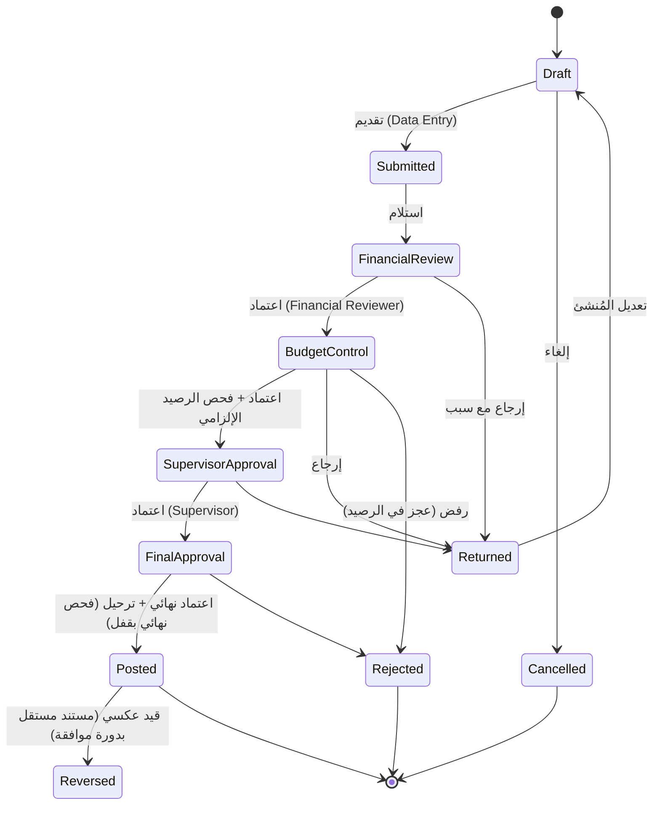

# G — دورة الموافقات (Workflow Engine)

## 1. المسار الافتراضي



## 2. قواعد المحرك

| رمز | القاعدة |
|---|---|
| WF-01 | كل مرحلة تتطلب صلاحية محددة (`workflow_steps.required_permission`)، ويُتحقق منها في الخادم وليس في الواجهة فقط |
| WF-02 | **فصل المهام:** من أنشأ المستند لا يعتمده في أي مرحلة، ومن اعتمد مرحلة لا يعتمد المرحلة التالية للمستند نفسه (قابل للإعداد) |
| WF-03 | الانتقال يكون للمرحلة التالية فقط، ولا قفز على المراحل. الإرجاع يعيد المستند إلى Draft |
| WF-04 | الرفض والإرجاع يتطلبان تعليقًا إلزاميًا |
| WF-05 | التعديل مسموح في Draft وReturned فقط. بعد التقديم يُقفل المستند (`row_version` + تحقق من الحالة) |
| WF-06 | فحص الرصيد: معلوماتي عند التقديم، وإلزامي في Budget Control، ونهائي بقفل عند Posting. لقطة الفحص تُحفظ في `workflow_actions.budget_check` |
| WF-07 | الترحيل و«الاعتماد النهائي» في معاملة واحدة: فإما ترحيل كامل أو لا شيء |
| WF-08 | شرائح المبالغ: خطوات يُتخطى عنها إذا كان المبلغ خارج `min_amount/max_amount` (مثل: الصرف أقل من 1,000 لا يحتاج اعتماد المشرف)، **ويُسجَّل التخطي** |
| WF-09 | التفويض المؤقت (Delegation): مستخدم يفوض صلاحيات الاعتماد لآخر لمدة محددة، ويُسجل ذلك في التدقيق |
| WF-10 | مهلة المرحلة (SLA): تنبيه «موافقة متأخرة» بعد N يوم قابلة للإعداد |
| WF-11 | كل إجراء يُسجل في `workflow_actions` وفي `audit_log`، مع IP والوقت |

## 3. المسارات لكل نوع مستند (افتراضية وقابلة للإعداد)

| المستند | Financial Review | Budget Control | Supervisor | Final Approval | فحص الرصيد |
|---|:-:|:-:|:-:|:-:|:-:|
| اعتماد أصلي، تعزيز | ✔ | ✔ | ✔ | ✔ | — |
| تخفيض | ✔ | ✔ | ✔ | ✔ | ✔ |
| تفويض وتوزيعه | ✔ | ✔ | — | ✔ | في نمط المستويين |
| مناقلة | ✔ | ✔ | ✔ | ✔ | ✔ للبند المصدر |
| طلب شراء (حجز) | — | ✔ | ✔ | — | ✔ |
| ارتباط (أمر شراء، عقد) | ✔ | ✔ | ✔ | ✔ | ✔ |
| مصروف فعلي | ✔ | ✔ | ✔ (≥ شريحة) | ✔ | ✔ |
| تسوية، قيد عكسي | ✔ | ✔ | ✔ | ✔ | ✔ إذا خفّض المتاح |
| إلغاء ارتباط معتمد | — | ✔ | ✔ | — | — |
| إقفال سنة | — | ✔ | ✔ | ✔ | — |

## 4. تسلسل الترحيل (Posting Sequence)

```mermaid
sequenceDiagram
    participant U as Approver
    participant API as FastAPI
    participant WF as Workflow Engine
    participant BC as Budget Control
    participant DB as PostgreSQL
    U->>API: POST /documents/{id}/approve
    API->>WF: can_act(user, step)? (صلاحية + فصل المهام + النطاق)
    WF->>DB: BEGIN
    WF->>BC: post(document)
    BC->>DB: SELECT … FROM budget_balances WHERE line IN (…) ORDER BY id FOR UPDATE
    BC->>BC: validate (سنة، فترة، بند) + check_availability
    alt رصيد غير كافٍ ولا توجد منحة استثناء
        BC-->>API: 409 INSUFFICIENT_BUDGET {available, requested, shortfall}
        WF->>DB: ROLLBACK
    else كافٍ
        BC->>DB: INSERT ledger_entries (…)
        BC->>DB: UPDATE budget_balances (…) version+1
        WF->>DB: UPDATE document SET status='POSTED'; INSERT workflow_actions
        Note over DB: triggers → audit_log (hash chain)
        WF->>DB: COMMIT
        API-->>U: 200 + موقف البند بعد الترحيل
        API->>API: background: alerts evaluation, refresh MVs
    end
```

الأقفال تُطلب **بترتيب ثابت (حسب id)** لتجنب الجمود (Deadlock) في المناقلات التي تقفل سطرين.
