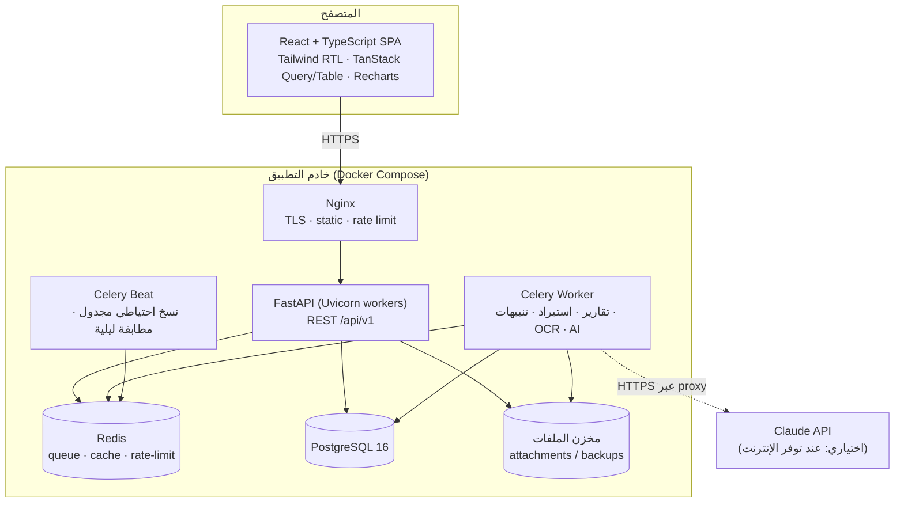

# J — معمارية النظام وواجهات البرمجة (System Architecture & API)

## 1. المعمارية العامة: Modular Monolith

اخترت **وحدة واحدة قابلة للنشر مقسمة داخليًا إلى وحدات مستقلة** بدل الخدمات المصغرة (Microservices)، للأسباب التالية:
- الترحيل المالي يحتاج **معاملة قاعدة بيانات واحدة** عبر عدة وحدات (مستند، دفتر، أرصدة، تدقيق). الخدمات المصغرة كانت ستفرض معاملات موزعة (Sagas) بلا مبرر.
- فريق تشغيل صغير على شبكة محلية.
- الحدود بين الوحدات واضحة، فيمكن فصل أي وحدة لاحقًا.



## 2. هيكل الكود الخلفي

```
backend/
  app/
    core/            config, security (JWT, hashing), db session, errors, pagination, i18n
    shared/          money (Decimal helpers), arabic_normalize, audit context, base models
    modules/
      auth/          login, refresh, logout, sessions, password policy
      users/         users, roles, permissions, scopes
      fiscal/        fiscal years, periods, closing & carry-forward
      catalog/       chapters, items, entities, funding sources, suppliers
      ledger/        ★ transaction engine, balances, availability check, reconciliation
      budget/        original budget, increases/decreases
      authorizations/
      transfers/
      commitments/
      expenditures/
      adjustments/   adjustments & reversals
      workflow/      ★ workflow engine, inbox, delegation
      documents/     attachments, storage, file validation
      alerts/        rules engine, notifications
      reports/       report engine, PDF (WeasyPrint), Excel (openpyxl)
      search/        global search
      imports/       ★ Excel import pipeline, data-quality report
      audit/         audit log API, hash-chain verification
      ai/            assistant (tool-calling), anomaly detection, OCR extraction
      backup/        backup/restore, health
    main.py
  alembic/
  tests/  unit/ integration/ api/ db/ security/ import/ financial/ workflow/ permissions/ regression/
```

**قاعدة الاعتماد بين الوحدات:** المستندات (transfers وcommitments…) تستدعي `ledger.post()` و`workflow` فقط عبر واجهاتها العامة (`service.py`). **لا توجد وحدة تكتب في `ledger_entries` أو `budget_balances` مباشرة إلا `ledger`.** اختبار معماري (import-linter) يفرض هذه القاعدة في CI.

كل وحدة: `models.py` (SQLAlchemy 2.0)، `schemas.py` (Pydantic v2)، `repository.py`، `service.py`، `router.py`، `permissions.py`، `tests/`.

## 3. الواجهة الأمامية

```
frontend/src/
  app/          router, providers, layout (RTL shell, sidebar, topbar)
  components/   ui/ (Button, Modal, Toast, DataTable, MoneyInput, Money, StatusBadge, …)
                charts/ (BudgetVsActual, Waterfall, Sankey, …)
  features/     dashboard, budget, authorizations, items, transfers, commitments,
                expenditures, approvals, reports, documents, alerts, audit, settings,
                imports, search, assistant, auth
  api/          OpenAPI-generated typed client (openapi-typescript) + TanStack Query hooks
  lib/          money.ts (decimal.js, no float), dates, arabic normalize, permissions
```

المبالغ في الواجهة `string` وتُعالج بـ **decimal.js**، ولا تُحوَّل إلى `number` أبدًا.

## 4. معايير واجهة REST

| المعيار | القرار |
|---|---|
| المسار | `/api/v1/...` |
| المصادقة | `Authorization: Bearer <access JWT>` (15 دقيقة)، وRefresh في كوكي `HttpOnly; Secure; SameSite=Strict` (8 ساعات، مع تدوير) |
| المبالغ | JSON string: `"amount": "179969.420"` |
| التواريخ | ISO 8601 |
| الترقيم | `?page=1&page_size=50` (حد أقصى 200)، والاستجابة `{items, total, page, page_size}`. سجل التدقيق والقيود بترقيم Cursor |
| الفلترة والترتيب | `?fiscal_year=2023&item=2/18&status=POSTED&sort=-entry_date` |
| التزامن | `If-Match: <row_version>` على التعديل، و`412` عند التعارض |
| عدم التكرار | `Idempotency-Key` على POST للإجراءات المالية (approve وpost وreverse) |
| الأخطاء | RFC 7807 `application/problem+json` مع `code` ورسالة عربية و`details` |
| توثيق | OpenAPI 3.1 تلقائي (`/api/docs` للمسؤول فقط في الإنتاج) |

**خطأ العجز (مثال):**
```json
HTTP 409
{
  "type": "https://gbcfms/errors/insufficient-budget",
  "code": "INSUFFICIENT_BUDGET",
  "title": "لا يوجد اعتماد متاح كافٍ لهذه العملية.",
  "details": {"budget_line": "2023 / 2/18", "available": "5000.000", "requested": "8000.000",
              "shortfall": "3000.000", "override_possible": false}
}
```

## 5. قائمة الواجهات (Endpoints)

| الوحدة | Endpoint | الوصف |
|---|---|---|
| auth | `POST /auth/login` · `POST /auth/refresh` · `POST /auth/logout` · `POST /auth/change-password` · `GET /auth/me` · `GET/DELETE /auth/sessions/{id}` | |
| users | `GET/POST /users` · `GET/PATCH /users/{id}` · `POST /users/{id}/deactivate` · `PUT /users/{id}/roles` · `PUT /users/{id}/scopes` · `GET/POST /roles` · `PUT /roles/{id}/permissions` · `GET /permissions` | |
| fiscal | `GET/POST /fiscal-years` · `POST /fiscal-years/{id}/open` · `POST /fiscal-years/{id}/close` (مهمة خلفية) · `GET /fiscal-years/{id}/periods` · `POST /periods/{id}/close` · `POST /periods/{id}/reopen` | |
| catalog | `GET/POST /chapters` · `GET/POST /items` · `PATCH /items/{id}` · `GET /items/tree` · `GET/POST /entities` · `GET/POST /suppliers` · `GET/POST /funding-sources` | |
| ledger | `GET /budget-lines?fiscal_year=` · `GET /budget-lines/{id}/position?as_of=` · `GET /budget-lines/{id}/timeline` · `POST /budget-lines/{id}/check` (`{amount}` ← نتيجة الفحص) · `GET /ledger-entries` · `POST /ledger/reconcile` | |
| budget | `GET/POST /budget-documents` · `GET/PATCH /budget-documents/{id}` | |
| authorizations | `GET/POST /authorizations` · `GET/PATCH /authorizations/{id}` · `PUT /authorizations/{id}/allocations` | |
| transfers | `GET/POST /transfers` · `GET/PATCH /transfers/{id}` | |
| commitments | `GET/POST /commitments` · `GET/PATCH /commitments/{id}` · `POST /commitments/{id}/convert` (PR ← PO) · `POST /commitments/{id}/cancel-remaining` · `GET /commitments/{id}/payments` | |
| expenditures | `GET/POST /expenditures` · `GET/PATCH /expenditures/{id}` · `POST /expenditures/duplicate-check` | |
| adjustments | `GET/POST /adjustments` · `POST /reversals` (`{source_type, source_id, reason}`) | |
| workflow (موحد لكل المستندات) | `POST /documents/{type}/{id}/submit` · `…/approve` · `…/reject` · `…/return` · `…/cancel` · `GET /documents/{type}/{id}/history` · `GET /inbox` · `GET/POST /delegations` · `GET/PUT /workflow-definitions` | |
| override | `GET/POST /override-grants` · `POST /override-grants/{id}/revoke` | |
| documents | `POST /attachments` (multipart) · `GET /attachments/{id}` · `GET /attachments/{id}/download` · `POST /attachments/{id}/links` · `GET /attachments?source_type=&source_id=` | |
| alerts | `GET /alerts` · `POST /alerts/{id}/ack` · `POST /alerts/{id}/resolve` · `GET /notifications` · `POST /notifications/read` · `GET/PUT /alert-rules/{code}` | |
| reports | `GET /reports` (الكتالوج) · `POST /reports/{code}/run` (JSON للمعاينة) · `POST /reports/{code}/export?format=pdf|xlsx` (← job) · `GET /jobs/{id}` · `GET /jobs/{id}/download` | |
| dashboard | `GET /dashboard/kpis?fiscal_year=` · `GET /dashboard/charts/{chart}?fiscal_year=` | |
| search | `GET /search?q=&type=&fiscal_year=&amount_min=&amount_max=&date_from=&date_to=&user=` | |
| imports | `POST /imports` (رفع) · `POST /imports/{id}/analyze` · `GET/PUT /imports/{id}/mapping` · `POST /imports/{id}/validate` · `GET /imports/{id}/issues` · `PUT /imports/{id}/decisions` · `GET /imports/{id}/preview` · `POST /imports/{id}/commit` · `GET /imports/{id}/report` · `POST /imports/{id}/rollback` (قبل أي ترحيل لاحق فقط) | |
| audit | `GET /audit-log` · `GET /audit-log/record/{table}/{id}` · `POST /audit-log/verify-chain` | |
| ai | `POST /ai/ask` (بث SSE) · `GET /ai/history` · `POST /ai/extract-document` (OCR ← اقتراح حقول) · `POST /ai/summary` (ملخص إداري لفترة) | |
| backup | `GET/PUT /backup/settings` · `POST /backup/run` · `GET /backups` · `POST /backups/{id}/verify` · `POST /backups/{id}/restore` (تأكيد مزدوج) · `GET /health` · `GET /health/db` | |
