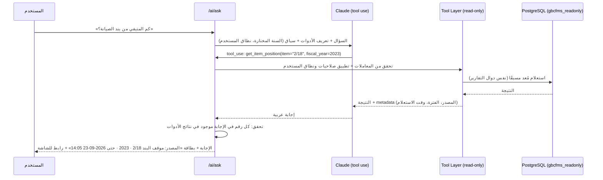

# N — معمارية الذكاء الاصطناعي (AI Architecture)

## 1. المبدأ الحاكم

> **الذكاء الاصطناعي يقرأ ويشرح ويقترح. لا يحسب رصيدًا ولا يكتب قيدًا ولا يعدّل رقمًا.**

| يُسمح للذكاء الاصطناعي | لا يُسمح له |
|---|---|
| اختيار أداة استعلام معرّفة مسبقًا وتمرير معاملاتها | كتابة SQL حر أو تنفيذه |
| صياغة الإجابة بالعربية من نتائج الأدوات | حساب أرقام مالية بنفسه (كل رقم في الإجابة يأتي من نتيجة أداة) |
| اقتراح قيم حقول من مستند ممسوح (OCR) | حفظ المستند أو تقديمه، فالمستخدم يراجع ويؤكد |
| إنشاء مسودة ملخص أو تقرير | اعتماد أو ترحيل أي شيء |

## 2. المساعد المالي الذكي

### أدوات المساعد (Tool Catalog)، وكلها قراءة فقط وتحترم صلاحيات المستخدم

| الأداة | يجيب عن |
|---|---|
| `get_item_position(item, fiscal_year, as_of?)` | «كم المتبقي من بند الصيانة؟» |
| `sum_actual(fiscal_year, from, to, items?)` | «ما إجمالي المصروفات في الربع الثاني؟» |
| `list_transfers(fiscal_year, order_by, limit)` | «ما أكبر المناقلات؟» |
| `list_pending_documents(type?, step?)` | «ما العمليات التي تنتظر الاعتماد؟» |
| `list_items_by_utilization(fiscal_year, min_rate, max_rate)` | «ما البنود التي تجاوز تنفيذها 80%؟» |
| `list_overbudget_items(fiscal_year)` | «هل يوجد بند تجاوز الاعتماد؟» |
| `explain_variance(item, fiscal_year)` | «ما سبب الفرق بين الاعتماد والمصروف؟»: يعيد تفكيك المكونات وأكبر المساهمين (مناقلات، ومصروفات كبيرة، وارتباطات) |
| `search_documents(query, filters)` | بحث بلغة طبيعية |
| `compare_years(item?, years[])` | مقارنة سنوات |
| `get_alerts(status, severity)` | التنبيهات |
| `suggest_report(question)` | يعيد رمز التقرير المناسب ومعاملاته |

**التحقق من الأرقام (Grounding Check):** بعد توليد الإجابة، يستخرج الخادم كل رقم فيها ويتحقق من وجوده (أو ناتجه البسيط المُعلن) في نتائج الأدوات. إذا فشل التحقق يُعاد التوليد، وإذا فشل مرة ثانية تُعرض النتائج كجدول خام بدون صياغة.

## 3. كشف الأنماط غير المعتادة: حتمي وليس نموذجًا لغويًا

قواعد إحصائية تعمل كمهمة خلفية، وتنتج تنبيهات:

| القاعدة | الطريقة |
|---|---|
| مبلغ غير معتاد للبند | Robust z-score (Median/MAD) على مصروفات البند في آخر 3 سنوات، والعتبة 3.5 |
| تجزئة المشتريات | عدة مصروفات لنفس المورد والبند خلال 7 أيام، كل منها أقل من حد الموافقة ومجموعها أكبر منه |
| مستند مكرر محتمل | نفس المورد والمبلغ، وتاريخ ±3 أيام |
| رقم مستدير مريب | مبالغ كبيرة من مضاعفات 1,000 مع تكرار عالٍ لنفس المستفيد |
| نهاية السنة | ارتفاع الصرف في آخر 15 يومًا عن متوسط السنة بأكثر من الضعف |
| صرف بلا ارتباط لبند يُتوقع فيه ارتباط (صيانة، تجهيزات) فوق حد معين | قاعدة |

النموذج اللغوي **يشرح** هذه التنبيهات فقط عند الطلب («لماذا هذا التنبيه؟»).

## 4. قراءة المستندات (OCR واستخراج البيانات)

1. رفع الفاتورة أو أمر الصرف (PDF أو صورة).
2. Worker: إذا كان PDF نصيًا يُستخرج النص مباشرة. وإذا كان صورة تُستخدم رؤية Claude (Vision) لاستخراج حقول منظمة (JSON Schema): رقم المستند، والتاريخ، والمورد، والمبلغ، والبنود.
3. **بدون إنترنت:** Tesseract محليًا (`ara+eng`) مع قواعد استخراج، بدقة أقل.
4. النموذج يُملأ كـ **اقتراح** بلون مميز مع درجة الثقة، والمستخدم يؤكد كل حقل.
5. النص المستخرج يُخزَّن في `attachments.ocr_text` لأغراض البحث.

## 5. الملخصات الإدارية ومسودات التقارير

`POST /ai/summary {fiscal_year, period}`: يجمع الخادم الأرقام بأدوات حتمية، ويصوغها النموذج في مسودة عربية («بلغت نسبة التنفيذ حتى نهاية الربع الثالث …»)، **وتُعرض كمسودة مع جدول الأرقام المصدرية**.

## 6. التشغيل والخصوصية

| البند | القرار |
|---|---|
| المزود | Claude API من Anthropic، والنموذج قابل للإعداد (`AI_MODEL`) |
| الاتصال | من Worker فقط عبر HTTPS proxy، والمتصفح لا يتصل بالمزود |
| التعطيل | `AI_ENABLED=false` يعطل الوحدة بالكامل، ويبقى النظام المالي يعمل 100% |
| البيانات المرسلة | نتائج الأدوات المطلوبة فقط، ولا تُرسل قاعدة البيانات ولا بيانات المستخدمين. أسماء الأفراد يمكن إخفاؤها (Masking) بإعداد |
| الحدود | حد أسئلة لكل مستخدم في الساعة، وحد رموز (tokens) لكل طلب |
| السجل | كل سؤال وأدواته وإجابته في `ai_interactions` |
| **قرار مطلوب D-14** | هل يُسمح بإرسال بيانات مالية مجمّعة إلى خدمة سحابية خارجية؟ إذا كان الجواب لا، فالبديل نموذج محلي (مثل Ollama) بجودة أقل للعربية، أو تعطيل المساعد |
