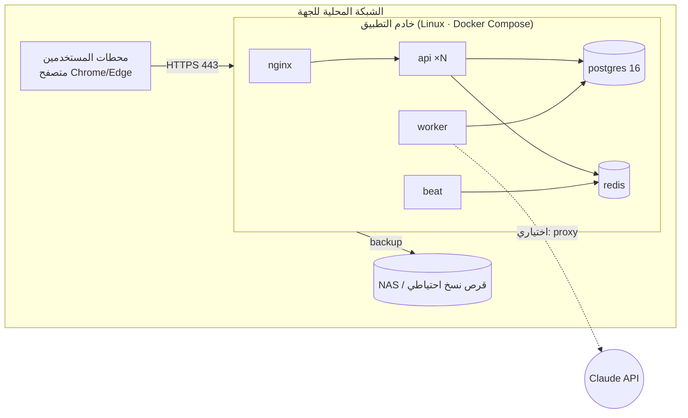

# Q — معمارية النشر (Deployment Architecture)

## 1. بيئة الشبكة المحلية (المرحلة الأولى)

| البند | المواصفة الدنيا المقترحة |
|---|---|
| الخادم | 8 vCPU، و16GB RAM، وSSD 500GB، وUbuntu Server 24.04 LTS |
| الحاويات | `nginx`، و`api` (Uvicorn، و4 workers)، و`worker` (Celery)، و`beat`، و`postgres:16`، و`redis:7`، و`clamav` (اختياري) |
| الشبكات | شبكة Docker داخلية، وnginx وحده منشور على 443 |
| الشهادة | من CA داخلي للجهة، أو شهادة موقعة ذاتيًا مع توزيع الـ CA على الأجهزة |
| الإعداد | `.env` + Docker secrets، وملف `docker-compose.prod.yml` |
| الترقية | `make upgrade`: نسخة احتياطية تلقائية ← سحب الصور ← `alembic upgrade head` ← إعادة التشغيل، مع التراجع بالاستعادة |

## 2. النسخ الاحتياطي والاستعادة

| الوظيفة | التنفيذ |
|---|---|
| نسخ يدوي | زر في الإعدادات، يعمل كمهمة Celery |
| نسخ مجدول | Celery beat وفق `backup_settings.cron` (افتراضيًا 02:00 يوميًا) |
| المحتوى | `pg_dump -Fc` لقاعدة البيانات + أرشيف المرفقات + بيان (manifest) يحتوي الإصدار وآخر Hash لسلسلة التدقيق وSHA-256 لكل ملف |
| التشفير | age (مفتاح عام على الخادم، ومفتاح خاص محفوظ خارجه لدى المسؤول) |
| المكان | مسار قابل للإعداد (NAS، أو قرص خارجي مركب، أو مجلد مشترك) |
| الاحتفاظ | آخر N نسخة (افتراضيًا 30) + نسخة شهرية لـ 12 شهرًا |
| التحقق | بعد كل نسخة: SHA-256 + `pg_restore --list`. وأسبوعيًا: استعادة كاملة في قاعدة مؤقتة + مطابقة الأرصدة (INV-08) + تحقق سلسلة التدقيق |
| الاستعادة | من الواجهة (مسؤول + تأكيد مزدوج) أو CLI، وتؤخذ نسخة `PRE_RESTORE` تلقائيًا قبلها |
| سجل النسخ | جدول `backups`، ويظهر في شاشة S-123 |
| صحة قاعدة البيانات | `/health/db`: الاتصال، والحجم، وأكبر الجداول، وعمر آخر VACUUM، والاتصالات النشطة، وآخر نسخة ناجحة، ومطابقة الأرصدة الأخيرة |

**هدف الاستعادة:** RPO ≤ 24 ساعة (≤ 15 دقيقة إذا فُعّل أرشيف WAL وهو مقترح)، وRTO ≤ 30 دقيقة.

## 3. البيئات

| البيئة | الغرض |
|---|---|
| `dev` | Docker Compose محليًا مع hot-reload وبيانات تجريبية مولدة (**بيانات اختبار وليست Mock تخفي وظائف**) |
| `test` | CI |
| `staging` | نسخة من الإنتاج ببيانات Excel المستوردة لاختبار القبول مع المحلل المالي |
| `prod` | خادم الجهة |

## 4. الانتقال لاحقًا إلى خادم مركزي

المعمارية لا تتغير: نفس الصور، مع إضافة موازن حمل أمام عدة نسخ `api`، وPostgreSQL بنسخة متماثلة (streaming replica)، وتخزين مرفقات S3-compatible (MinIO). الجهات المتعددة مدعومة أصلًا في نموذج البيانات (`entities` و`user_scopes`).

## 5. المراقبة

Prometheus metrics من FastAPI (زمن الاستجابة، والأخطاء)، وpostgres_exporter، وسجلات JSON إلى ملف مع تدوير (Loki اختياري). وتنبيه للمسؤول عند: فشل نسخة احتياطية، أو فرق في مطابقة الأرصدة، أو كسر سلسلة التدقيق، أو امتلاء القرص بنسبة 80%.
